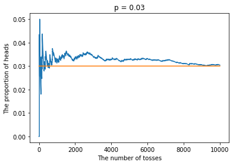

```python
import matplotlib.pyplot as plt
import numpy as np
import random
```

## 掷硬币模拟实验一

假设一枚硬币落地后正面朝上的概率为$p$，进行$n$次投掷。通过模拟实验验证正面朝上的比例将随着投掷次数的增加越来越接近$p$。


```python
# 进行一次投掷，如果返回True则表示获得正面，否则反面
def make_a_toss(p):
    r = random.randint(1, 100)
    return r <= (100*p)
```


```python
def simulate1(p, n=1000):
    heads = []
    count = 0
    for i in range(n):
        if make_a_toss(p):
            count += 1
        heads.append(count)
    x = np.array(range(1, n + 1))
    y = np.array(heads).astype(np.float32) / x
    plt.plot(x, y)
    plt.plot(x, np.ones(n) * p)
    plt.xlabel('The number of tosses')
    plt.ylabel('The proportion of heads')
    plt.title(f'p = {p}')
    plt.show()
```


```python
# p=0.3
simulate1(0.3)
```


```python
# p=0.03
simulate1(.03, 10000)
```





## 掷硬币模拟实验二

假设一枚硬币落地后正面朝上的概率为$p$，进行$n$次投掷，定义$X$为正面朝上的次数。通过模拟实验验证$X$将随着实验次数的增加越来越接近$np$。


```python
def moving_avg(x):
    result = np.array([.0] * len(x))
    s = 0
    for i, v in enumerate(x):
        s += v
        result[i] = s / (i + 1)
    return result
```


```python
def simulate2(p, n=1000):

    def one_experiment():
        heads = 0
        for i in range(n):
            if make_a_toss(p):
                heads += 1
        return heads

    heads = []
    for _ in range(1000): # do 1000 experiments
        heads.append(one_experiment())
    x = np.array(range(1, 1001))
    y = moving_avg(heads)
    plt.plot(x, y)
    plt.plot(x, np.ones(1000) * p * n)
    plt.xlabel('The number of experiments')
    plt.ylabel('The number of heads')
    plt.title(f'p = {p}')
    plt.show()
```


```python
# p=0.3, n=10
simulate2(0.3, 10)
```


```python
# p=0.3, n=100
simulate2(0.3, 100)
```


```python
# p=0.3, n=1000
simulate2(0.3, 1000)
```


