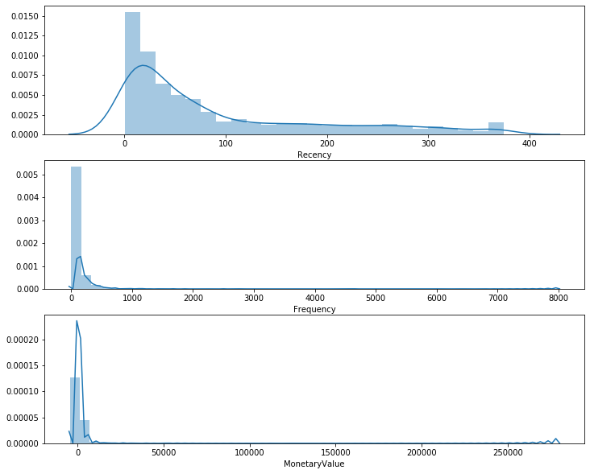
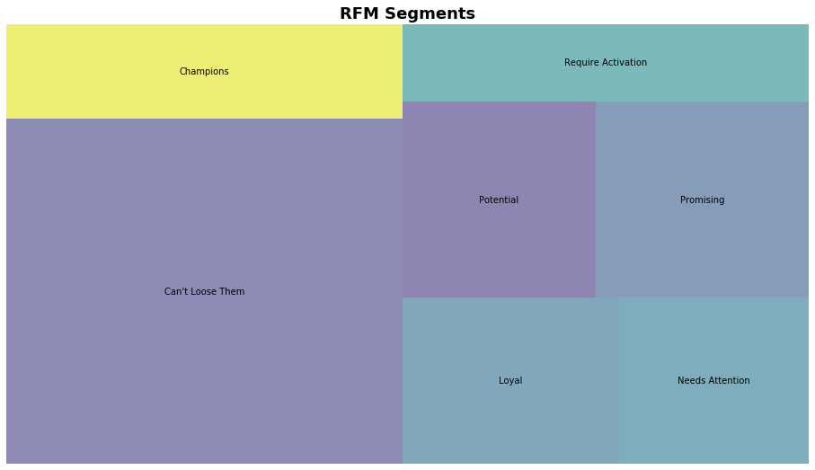

RFM是一种用于分析客户价值的方法，常用于营销。其中RFM代表三个维度：

- **R**ecency 表示最近一次客户购买的时间
- **F**requency 表示在统计周期内客户购买的次数
- **M**onetary Value 表示统计周期内客户消费的总金额

接下来，我们使用RFM模型分析一个真实的[在线购物数据](https://www.kaggle.com/carrie1/ecommerce-data#data.csv)。

```python
# Import libraries
import pandas as pd
import matplotlib.pyplot as plt
import squarify
from datetime import timedelta
import seaborn as sns
```


```python
# Read dataset
online = pd.read_csv('data.csv', encoding='ISO-8859-1')
online.head()
```


<div>
<style scoped>
    .dataframe tbody tr th:only-of-type {
        vertical-align: middle;
    }

    .dataframe tbody tr th {
        vertical-align: top;
    }

    .dataframe thead th {
        text-align: right;
    }
</style>
<table border="1" class="dataframe">
  <thead>
    <tr style="text-align: right;">
      <th></th>
      <th>InvoiceNo</th>
      <th>StockCode</th>
      <th>Description</th>
      <th>Quantity</th>
      <th>InvoiceDate</th>
      <th>UnitPrice</th>
      <th>CustomerID</th>
      <th>Country</th>
    </tr>
  </thead>
  <tbody>
    <tr>
      <th>0</th>
      <td>536365</td>
      <td>85123A</td>
      <td>WHITE HANGING HEART T-LIGHT HOLDER</td>
      <td>6</td>
      <td>12/1/2010 8:26</td>
      <td>2.55</td>
      <td>17850.0</td>
      <td>United Kingdom</td>
    </tr>
    <tr>
      <th>1</th>
      <td>536365</td>
      <td>71053</td>
      <td>WHITE METAL LANTERN</td>
      <td>6</td>
      <td>12/1/2010 8:26</td>
      <td>3.39</td>
      <td>17850.0</td>
      <td>United Kingdom</td>
    </tr>
    <tr>
      <th>2</th>
      <td>536365</td>
      <td>84406B</td>
      <td>CREAM CUPID HEARTS COAT HANGER</td>
      <td>8</td>
      <td>12/1/2010 8:26</td>
      <td>2.75</td>
      <td>17850.0</td>
      <td>United Kingdom</td>
    </tr>
    <tr>
      <th>3</th>
      <td>536365</td>
      <td>84029G</td>
      <td>KNITTED UNION FLAG HOT WATER BOTTLE</td>
      <td>6</td>
      <td>12/1/2010 8:26</td>
      <td>3.39</td>
      <td>17850.0</td>
      <td>United Kingdom</td>
    </tr>
    <tr>
      <th>4</th>
      <td>536365</td>
      <td>84029E</td>
      <td>RED WOOLLY HOTTIE WHITE HEART.</td>
      <td>6</td>
      <td>12/1/2010 8:26</td>
      <td>3.39</td>
      <td>17850.0</td>
      <td>United Kingdom</td>
    </tr>
  </tbody>
</table>
</div>


```python
online.dtypes
```


    InvoiceNo       object
    StockCode       object
    Description     object
    Quantity         int64
    InvoiceDate     object
    UnitPrice      float64
    CustomerID     float64
    Country         object
    dtype: object


```python
# Convert InvoiceDate from object to datetime format
online['InvoiceDate'] = pd.to_datetime(online['InvoiceDate'])
```


```python
online.dtypes
```


    InvoiceNo              object
    StockCode              object
    Description            object
    Quantity                int64
    InvoiceDate    datetime64[ns]
    UnitPrice             float64
    CustomerID            float64
    Country                object
    dtype: object


```python
# Check how many rows and columns
online.shape
```


    (541909, 8)


```python
# Count transactions that don't have a customer id
print('{:,} transactions don\'t have a customer id'
     .format(online[online.CustomerID.isnull()].shape[0]))
```

    135,080 transactions don't have a customer id


```python
# Check invoice date range
print('Transactions timeframe from {} to {}'
     .format(online.InvoiceDate.min(), online.InvoiceDate.max()))
```

    Transactions timeframe from 2010-12-01 08:26:00 to 2011-12-09 12:50:00


```python
# Drop NA values from online
online.dropna(inplace=True)
```


```python
# Group data by CustomerID

# Create TotalSum column for online dataset
online['TotalSum'] = online['Quantity'] * online['UnitPrice']

# Create snapshot date
snapshot_date = online.InvoiceDate.max() + timedelta(days=1)
print(snapshot_date)

# Group by CustomerID
data = online.groupby(['CustomerID']).agg({
    'InvoiceDate': lambda x: (snapshot_date - x.max()).days,
    'InvoiceNo': 'count',
    'TotalSum': 'sum'
})

data.rename(columns={'InvoiceDate': 'Recency',
                     'InvoiceNo': 'Frequency',
                     'TotalSum': 'MonetaryValue'}, inplace=True)
```

    2011-12-10 12:50:00


```python
# Peek first 5 rows
data.head()
```


<div>
<style scoped>
    .dataframe tbody tr th:only-of-type {
        vertical-align: middle;
    }

    .dataframe tbody tr th {
        vertical-align: top;
    }

    .dataframe thead th {
        text-align: right;
    }
</style>
<table border="1" class="dataframe">
  <thead>
    <tr style="text-align: right;">
      <th></th>
      <th>Recency</th>
      <th>Frequency</th>
      <th>MonetaryValue</th>
    </tr>
    <tr>
      <th>CustomerID</th>
      <th></th>
      <th></th>
      <th></th>
    </tr>
  </thead>
  <tbody>
    <tr>
      <th>12346.0</th>
      <td>326</td>
      <td>2</td>
      <td>0.00</td>
    </tr>
    <tr>
      <th>12347.0</th>
      <td>2</td>
      <td>182</td>
      <td>4310.00</td>
    </tr>
    <tr>
      <th>12348.0</th>
      <td>75</td>
      <td>31</td>
      <td>1797.24</td>
    </tr>
    <tr>
      <th>12349.0</th>
      <td>19</td>
      <td>73</td>
      <td>1757.55</td>
    </tr>
    <tr>
      <th>12350.0</th>
      <td>310</td>
      <td>17</td>
      <td>334.40</td>
    </tr>
  </tbody>
</table>
</div>


```python
# Check how many rows and columns
data.shape
```


    (4372, 3)


在这里我们可以看到，根据CutomerID进行分组后，我们聚合生成了每个客户最近一次购买的时间，购买频率和消费额度，共4372条记录。接下来，我们需要对这三个维度进行打分，这可以通过`.qcut()`来进行。但在此之前，我们先看一看特征的分布情况。


```python
# Plot RFM distributions
plt.figure(figsize=(12,10))

# Plot distribution of R
plt.subplot(3, 1, 1)
sns.distplot(data['Recency'])

# Plot distribution of F
plt.subplot(3, 1, 2)
sns.distplot(data['Frequency'])

# Plot distribution of M
plt.subplot(3, 1, 3)
sns.distplot(data['MonetaryValue'])
```


    <matplotlib.axes._subplots.AxesSubplot at 0x1199779b0>





```python
# Calculate R and F groups

# Create labels for Recency and Frequency
r_labels = range(4, 0, -1)
f_labels = range(1, 5)

# Assign these labels to 4 equal percentil groups
r_groups = pd.qcut(data['Recency'], q=4, labels=r_labels)

f_groups = pd.qcut(data['Frequency'], q=4, labels=f_labels)

# Create new columns R and F
data = data.assign(R=r_groups.values, F=f_groups.values)
data.head()
```


<div>
<style scoped>
    .dataframe tbody tr th:only-of-type {
        vertical-align: middle;
    }

    .dataframe tbody tr th {
        vertical-align: top;
    }

    .dataframe thead th {
        text-align: right;
    }
</style>
<table border="1" class="dataframe">
  <thead>
    <tr style="text-align: right;">
      <th></th>
      <th>Recency</th>
      <th>Frequency</th>
      <th>MonetaryValue</th>
      <th>R</th>
      <th>F</th>
    </tr>
    <tr>
      <th>CustomerID</th>
      <th></th>
      <th></th>
      <th></th>
      <th></th>
      <th></th>
    </tr>
  </thead>
  <tbody>
    <tr>
      <th>12346.0</th>
      <td>326</td>
      <td>2</td>
      <td>0.00</td>
      <td>1</td>
      <td>1</td>
    </tr>
    <tr>
      <th>12347.0</th>
      <td>2</td>
      <td>182</td>
      <td>4310.00</td>
      <td>4</td>
      <td>4</td>
    </tr>
    <tr>
      <th>12348.0</th>
      <td>75</td>
      <td>31</td>
      <td>1797.24</td>
      <td>2</td>
      <td>2</td>
    </tr>
    <tr>
      <th>12349.0</th>
      <td>19</td>
      <td>73</td>
      <td>1757.55</td>
      <td>3</td>
      <td>3</td>
    </tr>
    <tr>
      <th>12350.0</th>
      <td>310</td>
      <td>17</td>
      <td>334.40</td>
      <td>1</td>
      <td>1</td>
    </tr>
  </tbody>
</table>
</div>


```python
# Create labels form MonetaryValue
m_labels = range(1, 5)
m_groups = pd.qcut(data['MonetaryValue'], q=4, labels=m_labels)
data = data.assign(M=m_groups.values)
```


```python
data.head()
```


<div>
<style scoped>
    .dataframe tbody tr th:only-of-type {
        vertical-align: middle;
    }

    .dataframe tbody tr th {
        vertical-align: top;
    }

    .dataframe thead th {
        text-align: right;
    }
</style>
<table border="1" class="dataframe">
  <thead>
    <tr style="text-align: right;">
      <th></th>
      <th>Recency</th>
      <th>Frequency</th>
      <th>MonetaryValue</th>
      <th>R</th>
      <th>F</th>
      <th>M</th>
    </tr>
    <tr>
      <th>CustomerID</th>
      <th></th>
      <th></th>
      <th></th>
      <th></th>
      <th></th>
      <th></th>
    </tr>
  </thead>
  <tbody>
    <tr>
      <th>12346.0</th>
      <td>326</td>
      <td>2</td>
      <td>0.00</td>
      <td>1</td>
      <td>1</td>
      <td>1</td>
    </tr>
    <tr>
      <th>12347.0</th>
      <td>2</td>
      <td>182</td>
      <td>4310.00</td>
      <td>4</td>
      <td>4</td>
      <td>4</td>
    </tr>
    <tr>
      <th>12348.0</th>
      <td>75</td>
      <td>31</td>
      <td>1797.24</td>
      <td>2</td>
      <td>2</td>
      <td>4</td>
    </tr>
    <tr>
      <th>12349.0</th>
      <td>19</td>
      <td>73</td>
      <td>1757.55</td>
      <td>3</td>
      <td>3</td>
      <td>4</td>
    </tr>
    <tr>
      <th>12350.0</th>
      <td>310</td>
      <td>17</td>
      <td>334.40</td>
      <td>1</td>
      <td>1</td>
      <td>2</td>
    </tr>
  </tbody>
</table>
</div>


```python
# Concat RFM quartile values to create RFM segments
def join_rfm(x):
    return str(x['R']) + str(x['F']) + str(x['M'])

data['RFM_segment_concat'] = data.apply(join_rfm, axis=1)
rfm = data
rfm.head()
```


<div>
<style scoped>
    .dataframe tbody tr th:only-of-type {
        vertical-align: middle;
    }

    .dataframe tbody tr th {
        vertical-align: top;
    }

    .dataframe thead th {
        text-align: right;
    }
</style>
<table border="1" class="dataframe">
  <thead>
    <tr style="text-align: right;">
      <th></th>
      <th>Recency</th>
      <th>Frequency</th>
      <th>MonetaryValue</th>
      <th>R</th>
      <th>F</th>
      <th>M</th>
      <th>RFM_segment_concat</th>
    </tr>
    <tr>
      <th>CustomerID</th>
      <th></th>
      <th></th>
      <th></th>
      <th></th>
      <th></th>
      <th></th>
      <th></th>
    </tr>
  </thead>
  <tbody>
    <tr>
      <th>12346.0</th>
      <td>326</td>
      <td>2</td>
      <td>0.00</td>
      <td>1</td>
      <td>1</td>
      <td>1</td>
      <td>111</td>
    </tr>
    <tr>
      <th>12347.0</th>
      <td>2</td>
      <td>182</td>
      <td>4310.00</td>
      <td>4</td>
      <td>4</td>
      <td>4</td>
      <td>444</td>
    </tr>
    <tr>
      <th>12348.0</th>
      <td>75</td>
      <td>31</td>
      <td>1797.24</td>
      <td>2</td>
      <td>2</td>
      <td>4</td>
      <td>224</td>
    </tr>
    <tr>
      <th>12349.0</th>
      <td>19</td>
      <td>73</td>
      <td>1757.55</td>
      <td>3</td>
      <td>3</td>
      <td>4</td>
      <td>334</td>
    </tr>
    <tr>
      <th>12350.0</th>
      <td>310</td>
      <td>17</td>
      <td>334.40</td>
      <td>1</td>
      <td>1</td>
      <td>2</td>
      <td>112</td>
    </tr>
  </tbody>
</table>
</div>


```python
# Count num of unique segments
rfm_count_unique = rfm.groupby('RFM_segment_concat')['RFM_segment_concat'].nunique()
print(rfm_count_unique.sum())
```

    62


以上结果显示，将RFM连接在一起这种方法共形成62个划分，但划分太多了不能用于实际应用。下面我们尝试将这三个值相加。


```python
# Calculate RFM_Score
rfm['RFM_Score'] = rfm[['R', 'F', 'M']].sum(axis=1)
print(rfm['RFM_Score'].head())
```

    CustomerID
    12346.0     3.0
    12347.0    12.0
    12348.0     8.0
    12349.0    10.0
    12350.0     4.0
    Name: RFM_Score, dtype: float64


```python
# Define rfm_level function
def rfm_level(df):
    if df['RFM_Score'] >= 9:
        return 'Can\'t Loose Them'
    elif ((df['RFM_Score'] >= 8) and (df['RFM_Score'] < 9)):
        return 'Champions'
    elif ((df['RFM_Score'] >= 7) and (df['RFM_Score'] < 8)):
        return 'Loyal'
    elif ((df['RFM_Score'] >= 6) and (df['RFM_Score'] < 7)):
        return 'Potential'
    elif ((df['RFM_Score'] >= 5) and (df['RFM_Score'] < 6)):
        return 'Promising'
    elif ((df['RFM_Score'] >= 4) and (df['RFM_Score'] < 5)):
        return 'Needs Attention'
    else:
        return 'Require Activation'

# Create a new variable RFM_Level
rfm['RFM_Level'] = rfm.apply(rfm_level, axis=1)

rfm.head()
```


<div>
<style scoped>
    .dataframe tbody tr th:only-of-type {
        vertical-align: middle;
    }

    .dataframe tbody tr th {
        vertical-align: top;
    }

    .dataframe thead th {
        text-align: right;
    }
</style>
<table border="1" class="dataframe">
  <thead>
    <tr style="text-align: right;">
      <th></th>
      <th>Recency</th>
      <th>Frequency</th>
      <th>MonetaryValue</th>
      <th>R</th>
      <th>F</th>
      <th>M</th>
      <th>RFM_segment_concat</th>
      <th>RFM_Score</th>
      <th>RFM_Level</th>
    </tr>
    <tr>
      <th>CustomerID</th>
      <th></th>
      <th></th>
      <th></th>
      <th></th>
      <th></th>
      <th></th>
      <th></th>
      <th></th>
      <th></th>
    </tr>
  </thead>
  <tbody>
    <tr>
      <th>12346.0</th>
      <td>326</td>
      <td>2</td>
      <td>0.00</td>
      <td>1</td>
      <td>1</td>
      <td>1</td>
      <td>111</td>
      <td>3.0</td>
      <td>Require Activation</td>
    </tr>
    <tr>
      <th>12347.0</th>
      <td>2</td>
      <td>182</td>
      <td>4310.00</td>
      <td>4</td>
      <td>4</td>
      <td>4</td>
      <td>444</td>
      <td>12.0</td>
      <td>Can't Loose Them</td>
    </tr>
    <tr>
      <th>12348.0</th>
      <td>75</td>
      <td>31</td>
      <td>1797.24</td>
      <td>2</td>
      <td>2</td>
      <td>4</td>
      <td>224</td>
      <td>8.0</td>
      <td>Champions</td>
    </tr>
    <tr>
      <th>12349.0</th>
      <td>19</td>
      <td>73</td>
      <td>1757.55</td>
      <td>3</td>
      <td>3</td>
      <td>4</td>
      <td>334</td>
      <td>10.0</td>
      <td>Can't Loose Them</td>
    </tr>
    <tr>
      <th>12350.0</th>
      <td>310</td>
      <td>17</td>
      <td>334.40</td>
      <td>1</td>
      <td>1</td>
      <td>2</td>
      <td>112</td>
      <td>4.0</td>
      <td>Needs Attention</td>
    </tr>
  </tbody>
</table>
</div>


```python
# Calculate average values for each RFM_Level, and return a size of each segment
rfm_level_agg = rfm.groupby('RFM_Level').agg({
    'Recency': 'mean',
    'Frequency': 'mean',
    'MonetaryValue': ['mean', 'count']
}).round(1)

# Print the aggregate dataset
print(rfm_level_agg)
```

                       Recency Frequency MonetaryValue
                          mean      mean          mean count
    RFM_Level
    Can't Loose Them      25.2     195.1        4130.3  1690
    Champions             62.7      57.0         974.7   467
    Loyal                 78.8      39.7         724.2   447
    Needs Attention      174.5      13.9         227.1   391
    Potential             94.3      28.5         491.8   468
    Promising            153.0      21.2         346.8   517
    Require Activation   264.8       7.8         109.1   392


从以上结果我们可以看到，约60%的客户属于优质客户（前三类用户）。


```python
# Visualize segments
rfm_level_agg.columns = rfm_level_agg.columns.droplevel()
rfm_level_agg.columns = ['RecencyMean', 'FrequencyMean', 'MonetaryMean', 'Count']
```


```python
# Create our plot and resize it
fig = plt.gcf()
ax = fig.add_subplot()
fig.set_size_inches(16, 9)

squarify.plot(sizes=rfm_level_agg['Count'], label=list(rfm_level_agg.index), alpha=.6)
plt.title('RFM Segments', fontsize=18, fontweight='bold')
plt.axis('off')
plt.show()
```



